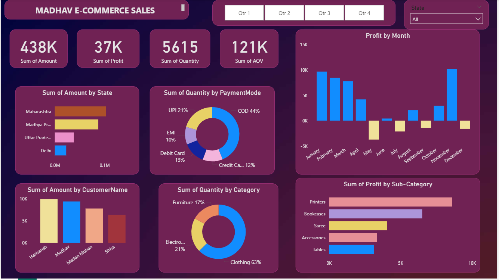

# 🛍 Madhav Store Online Sales Dashboard

## 📷 Dashboard Preview

An interactive Power BI dashboard built to analyze and track online sales performance across different states in India.

---

## 📌 Objective

The objective of this project is to help the business owner monitor sales performance, identify top-performing states, and analyze monthly trends to support data-driven decisions.

---

## 🛠 Tools Used

- Power BI  
- Power Query  
- DAX  
- Excel (Dataset)

---

## 📊 Dashboard Features

- Total Sales, Profit & Orders KPIs  
- Monthly Sales Trend  
- Top 5 States by Revenue  
- Category & Sub-Category Performance  
- Interactive Filters and Slicers  

---

📊 Key Insights:
• Total sales reached 438K with 37K profit across 5615 orders
• Clothing category contributes 63% of total sales
• Maharashtra is the top-performing state by revenue
• Cash on Delivery accounts for ~44% of payments

 ---
 
📈 Business Recommendations:
• Promote high-margin products to increase profitability
• Encourage digital payments to reduce COD dependency
• Target high-performing states with focused marketing strategies
---

## 💡 Skills Demonstrated

- Data Cleaning & Transformation  
- Data Modeling  
- DAX Calculations  
- Interactive Dashboard Design  
- Business Insight Generation

